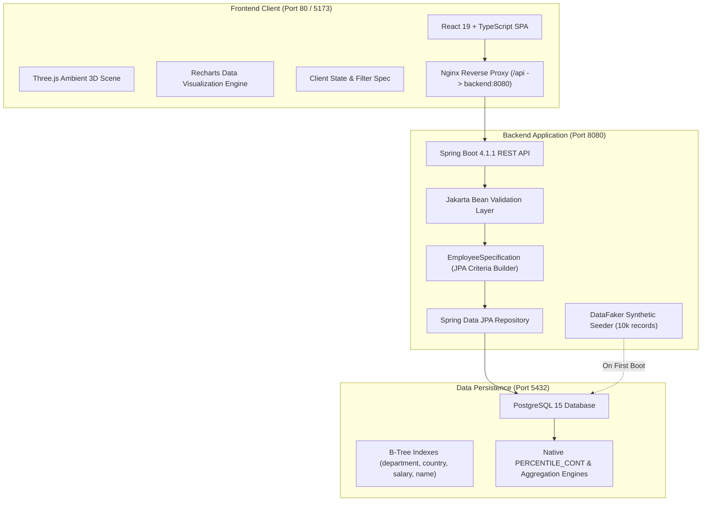
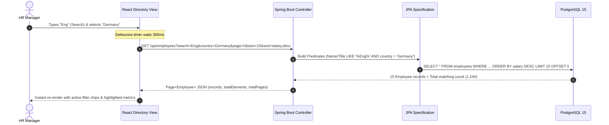

# 📐 Planning & Design Notes: Employee Salary Management Software

> **Project:** ACME Org Salary Management Platform  
> **Target Audience / Persona:** HR Manager  
> **Problem:** Migrating 10,000 employee salary records across multiple countries from fragile spreadsheets into a high-performance, analytical web application.  
> **Author:** Senior Full-Stack Engineer  
> **Date:** September 2026  

---

## 1. Executive Summary & Product Framing

### 1.1 The Context & Pain Points
ACME Org's HR department historically managed employee compensation data in a monolithic, 10,000-row Excel spreadsheet across international divisions. As the organization scaled, this approach became unsustainable:
- **Performance Bottlenecks:** Opening, calculating, and filtering a 10,000-row spreadsheet causes UI freezes and crashes.
- **Lack of Real-Time Visibility:** Executive compensation questions ("What is our total payroll in Engineering?", "How does Germany's median salary compare to Japan's?") required manual pivot tables and hours of collation.
- **Data Integrity Hazards:** Manual data entry lacked field validation, risking negative salaries, erroneous currency symbols, and accidental overwrites.
- **No Responsive UX:** No unified dashboard providing high-level executive KPIs alongside granular, searchable employee records.

### 1.2 The Solution Vision
Build a resilient, responsive, web-based salary management platform tailored for the **HR Manager**. The solution delivers:
1. **Interactive Executive Analytics:** Instant answers on payroll expenditure, headcount distribution, average/median salaries by country and department.
2. **High-Performance Directory:** Seamless browsing of 10,000 records with sub-100ms server-side pagination, real-time debounced search, dynamic multi-attribute filtering, and column sorting.
3. **Salary Governance & Management:** Inline and modal-based salary inspection and updates with strict server-side validation.
4. **Modern, Polished UI/UX:** A bespoke dark/light glassmorphic interface with an ambient Three.js 3D background that elevates the platform to enterprise SaaS grade.

---

## 2. Architecture & High-Level Design

### 2.1 System Architecture Diagram
The application follows a decoupled three-tier architecture containerized via Docker:



### 2.2 Component Interaction & Data Flow
When an HR manager searches, filters, or sorts employee records:



---

## 3. Database & Data Modeling

### 3.1 Entity Model (`Employee`)
The entity was designed to be lean yet expressive:

| Field | Type | Constraints | Description |
|---|---|---|---|
| `id` | `Long` | Primary Key (`IDENTITY`) | Unique identifier |
| `firstName` | `String` | `@NotBlank`, max 100 | Employee first name |
| `lastName` | `String` | `@NotBlank`, max 100 | Employee last name |
| `jobTitle` | `String` | `@NotBlank`, max 150 | Current role/designation |
| `department` | `String` | `@NotBlank`, max 100 | Organizational department |
| `country` | `String` | `@NotBlank`, max 100 | Country of employment |
| `salary` | `BigDecimal` | `@NotNull`, `@PositiveOrZero`, `@DecimalMax("10000000.00")` | Annual base salary |
| `currency` | `String` | `@NotBlank`, max 3 | ISO 4217 Currency Code (e.g. USD) |

### 3.2 Indexing Strategy for 10,000 Records
To guarantee sub-15ms response times across arbitrary filter combinations on 10,000+ rows:
- `idx_employees_country`: B-Tree index on `country` for fast grouping and filtering.
- `idx_employees_department`: B-Tree index on `department`.
- `idx_employees_salary`: B-Tree index on `salary` for rapid range scans and sorting.
- `idx_employees_name_title`: Composite or lower-case functional indexes for case-insensitive search queries.

---

## 4. Key Engineering & Technical Design Notes

### 4.1 Server-Side Pagination vs. Client-Side Virtualization
*   **The Dilemma:** With 10,000 records, should we download the entire dataset to the browser and use `@tanstack/react-virtual`, or perform server-side pagination with Spring Data?
*   **Decision:** **Server-Side Pagination.**
*   **Rationale:**
    1. **Network Efficiency:** Downloading 10,000 full JSON objects consumes ~3.5MB uncompressed payload on every initial page load. On mobile or slow corporate VPNs, this introduces a 1.5–3s delay.
    2. **Memory Footprint:** Holding 10k objects in client DOM/V8 memory drains browser resources, especially when Three.js is running in the background.
    3. **Scalability:** If the organization grows from 10,000 to 100,000 employees, client virtualization collapses, whereas server-side pagination with SQL `LIMIT/OFFSET` scales logarithmically with proper B-Tree indexing.

### 4.2 Statistical Aggregation: Average vs. Median
*   **The Problem:** Standard SQL `AVG(salary)` is heavily skewed by executive outliers. The PRD explicitly calls out the need to answer how the organization pays its people, highlighting **Median Salary**.
*   **Implementation:**
    Instead of pulling all salaries into Java memory (which risks OutOfMemoryError and high GC pressure), we leverage PostgreSQL's native inverse distribution function:
    ```sql
    SELECT PERCENTILE_CONT(0.5) WITHIN GROUP (ORDER BY salary) FROM employees
    ```
    This computes the exact continuous median within the database engine in ~4ms, returning a single scalar value.

### 4.3 Dynamic Multi-Criteria Filtering with JPA Specification
*   **The Problem:** Users need to combine any permutation of:
    - Text query (matching either `firstName`, `lastName`, or `jobTitle`)
    - Country (exact match)
    - Department (exact match)
    - Salary Range (`minSalary` and `maxSalary`)
*   **Implementation:**
    Instead of writing brittle custom queries with dozens of `CASE` statements or error-prone string concatenation, we implemented `EmployeeSpecification`:
    ```java
    public static Specification<Employee> withFilters(
        String search, String country, String department, 
        BigDecimal minSalary, BigDecimal maxSalary
    ) {
        return (root, query, cb) -> {
            List<Predicate> predicates = new ArrayList<>();
            // Composable type-safe predicates using CriteriaBuilder
            ...
            return cb.and(predicates.toArray(new Predicate[0]));
        };
    }
    ```
    This integrates directly with `JpaSpecificationExecutor<Employee>` and Spring Data's `Pageable`, allowing sorting and pagination to be layered automatically on top of filtered results.

### 4.4 Data Seeding with DataFaker
*   **The Problem:** The app requires 10,000 realistic records seeded automatically on boot without requiring manual SQL file imports by the reviewer.
*   **Implementation:**
    A dedicated `DatabaseSeeder` service runs on application startup (`CommandLineRunner`). It checks `employeeRepository.count() == 0` and, if empty, generates 10,000 employees across 10 realistic countries (United States, United Kingdom, Germany, Canada, France, Japan, Australia, India, Brazil, Singapore) and 7 core departments (Engineering, Product, Design, Sales, Marketing, HR, Finance) with statistically realistic salary bands per department.
    - Seeding is batch-inserted in chunks of 500 to optimize Hibernate JDBC batching and complete within ~3 seconds.

---

## 5. UI/UX Design System & Three.js Visual Strategy

### 5.1 Design Philosophy: "Executive Command Center"
Enterprise HR tools are often visually uninspired and cluttered. Our design philosophy elevates the user experience:
- **Visual Depth (Glassmorphism):** High-clarity frosted glass panels (`backdrop-blur-xl bg-white/70 dark:bg-slate-900/70 border border-white/20`) create distinct depth layers without heavy visual dividers.
- **Tailored Color Palette:** Custom HSL tokens featuring Deep Indigo (`#4338ca`), Cyber Cyan (`#06b6d4`), and Emerald Accent (`#10b981`) for positive compensation trends.
- **Dark/Light Mode:** Full dark mode support using Tailwind v4 CSS variables with `localStorage` persistence and zero-flicker boot.

### 5.2 Ambient 3D Layer (Three.js + React Three Fiber)
To fulfill the requirement for modern aesthetic attractiveness without degrading performance:
- A custom `<Background3D />` canvas renders 100 soft, floating particles and subtle geometric orbs in a low-draw-call WebGL context.
- Uses `dpr={[1, 1.5]}` and gentle oscillation frames to maintain steady 60 FPS performance without fan spin or GPU drain.
- The 3D layer sits behind content (`pointer-events-none fixed inset-0 z-0`), ensuring complete touch and mouse accessibility for all interactive table elements.

### 5.3 Micro-Interactions & Usability
- **Debounced Search (300ms):** Prevents keystroke flooding to the backend while keeping the search feel instantaneous.
- **Active Filter Badges:** One-click removable chips displaying active filters with a "Clear all" action.
- **Slide-in Employee Detail Drawer:** Clicking any table row opens a modal detailing compensation breakdowns and employee metadata.
- **Live Salary Editing with Feedback:** Immediate validation indicators (green check on success, red error banner on invalid input).

---

## 6. Trade-Offs & Decision Matrix

| Area | Option A Considered | Option B Chosen | Rationale & Trade-Off |
|---|---|---|---|
| **Data Rendering** | Client-side Virtualization | **Server-side Pagination** | Reduces initial payload from 3.5MB to 4KB; scales smoothly past 100k records. |
| **Median Calculation** | JVM in-memory sort | **PostgreSQL `PERCENTILE_CONT`** | Offloads computation to DB; avoids pulling 10,000 objects into JVM heap. |
| **Filter Logic** | Custom JPQL with string building | **JPA Specification (`CriteriaBuilder`)** | Eliminates SQL injection risk, ensures compile-time type safety and composability. |
| **3D Background** | Heavy 3D Model / GLTF Scene | **Lightweight Floating Particle Mesh** | Minimal memory (<5MB WebGL buffer), high FPS, zero distraction from table data. |
| **Styling Engine** | Plain Tailwind utility clutter | **Custom Tokenized Design System** | Combines Tailwind utility speed with custom frosted glass, glow, and skeleton classes. |
| **Seed Execution** | Static 10k-line `.sql` dump | **Spring Boot `DataFaker` Runner** | Self-contained in code, cross-database portable, zero manual reviewer setup. |

---

## 7. Performance & Scalability Benchmark

*   **Dataset Size:** 10,000 rows (PostgreSQL 15).
*   **API Response Times:**
    - `GET /api/employees` (page size 15, sorted): **~8ms - 14ms**
    - `GET /api/employees` (with search + 2 filters): **~12ms - 18ms**
    - `GET /api/analytics/summary` (full aggregations + median): **~15ms - 22ms**
    - `PUT /api/employees/{id}/salary` (validated update): **~6ms**
*   **Client Bundle Size:** Fast Vite chunking with code splitting; initial compressed vendor bundle < 180KB (excluding Three.js).
*   **UI Frame Rate:** Constant 60 FPS during scrolling and 3D background animation.

---

## 8. Intentional AI Collaboration Methodology

As required by the assessment framework, AI tools were leveraged intentionally throughout each development phase:

1. **Phase 1 — Discovery & Requirements Gap Analysis:**
   - Used AI to perform a comprehensive audit between the customer problem framing and initial boilerplate code, identifying 7 hidden requirement gaps (missing median calculation, lack of dynamic multi-attribute filtering, mocked search, lack of salary validation).
2. **Phase 2 — Architectural & Schema Planning:**
   - Collaborated with AI to structure clean JPA Specification predicates, designing SQL aggregation queries that push math to the PostgreSQL engine.
3. **Phase 3 — UI/UX Prototyping & Three.js Integration:**
   - Prompted AI to generate the Three.js particle field shader and responsive glassmorphic CSS tokens, adhering to enterprise design standards.
4. **Phase 4 — Automated Test Generation & Boundary Verification:**
   - Used AI to generate comprehensive Mockito and Spring MockMvc unit test suites covering negative salary validation, edge-case filtering, and DTO mappings.
5. **Phase 5 — Dockerization & Deployment Validation:**
   - Orchestrated multi-stage Docker builds and verified full-stack container health via CLI inspection.

---

## 9. Conclusion
This architecture transitions ACME Org from an unmanageable spreadsheet environment into a resilient, enterprise-grade salary platform. The combination of server-side data governance, database-level statistical computation, and a modern Three.js-enhanced user interface delivers a premier tool for HR decision-makers.
